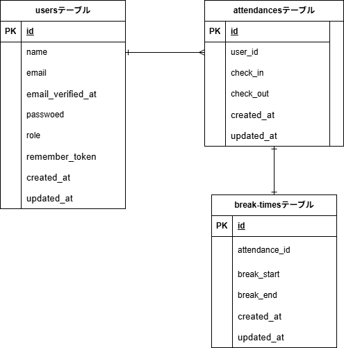

# 勤怠管理アプリ  

## 環境構築  
### Dockerビルド  
1. `git clone git@github.com:miho-85-ux/TimeandAttendanceManagement.git`  
2. `cd TimeandAttendanceManagement`  
3. DockerDesktopアプリを立ち上げる  
```bash  
docker-compose up -d --build  
```  
4. プロジェクト直下で以下のコマンドを入力
```bash
make init
```
※Makefileを使用しています。実行するコマンドを省略することができます。

5. envに以下の環境変数を追加  
``` text  
DB_CONNECTION=mysql 
DB_HOST=mysql 
DB_PORT=3306 
DB_DATABASE=laravel_db 
DB_USERNAME=laravel_user 
DB_PASSWORD=laravel_pass 
```  

## Mailtrap    
1. Mailtrapのアカウントを作る  
```bash  
https://mailtrap.io  
```
2. SandboxのCredentialsを.envに設定  
```text  
MAIL_MAILER=smtp
MAIL_HOST=[your-smtp-host]
MAIL_PORT=2525
MAIL_USERNAME=[your-username]
MAIL_PASSWORD=[your-password]
MAIL_ENCRYPTION=tls
```
3. キャッシュをクリア
```bash
php artisan config:clear
```
4. メールを確認


## 独自テストの実行  

プロジェクト固有の主要な機能について、以下のテストを実装しています。

#### 1. 実装済みの主なテスト内容
- **認証機能 (`UserAuthTest.php`)**: ログイン、会員登録、パスワードリセットの挙動。
- **決済処理 (`PaymentProcessTest.php`)**: Stripe APIとの連携および注文ステータスの更新。
- **データインポート (`CsvImportTest.php`)**: 大規模CSVアップロード時のバリデーションとDB登録。

#### 2. 特定のテストを指定して実行
今回作成した特定のテストクラスのみを実行するには、以下のコマンドを使用してください。

```bash
# クラス単位で実行（例：決済テスト）
php artisan test --filter PaymentProcessTest

# 特定のメソッドのみ実行（例：ログイン失敗のケースだけ）
php artisan test --filter test_ログイン時にパスワードが間違っているとエラーを返す
```
<!-- ### 書く時のコツ（ポイント）

1.  **「なぜこのテストが必要か」を一行添える**
    *   単にファイル名を並べるより、「〇〇の不具合を防ぐためのテスト」と書かれていると、テストの重要性が伝わります。
2.  **独自の環境変数（APIキーなど）があれば明記する**
    *   もし外部サービス（StripeやAWSなど）をモック化せずにテストしている場合、「`.env.testing` に `STRIPE_KEY` が必要です」といった注意書きは必須です。
3.  **コマンドはコピペできるようにする**
    *   `--filter` などのオプションを含めたフルコマンドを載せておくと、初心者が迷いません。
 -->

## PHPUnitを利用したテストに関して
以下のコマンド:  
```
//テスト用データベースの作成
docker-compose exec mysql bash
mysql -u root -p
//パスワードはrootと入力
create database test_database;

docker-compose exec php bash
php artisan migrate:fresh --env=testing
./vendor/bin/phpunit
```
※.env.testingにもStripeのAPIキーを設定してください。  

## テーブル仕様書について
### usersテーブル
| カラム名 | 型 | primary key | unique key | not null | foreign key |
| --- | --- | --- | --- | --- | --- |
| id | bigint | ◯ |  | ◯ |  |
| name | varchar(255) |  |  | ◯ |  |
| email | varchar(255) |  | ◯ | ◯ |  |
| email_verified_at | timestamp |  |  |  |  |
| password | varchar(255) |  |  | ◯ |  |
| remember_token | varchar(100) |  |  |  |  |
| created_at | timestamp |  |  |  |  |
| updated_at | timestamp |  |  |  |  |

### テーブル
| カラム名 | 型 | primary key | unique key | not null | foreign key |
| --- | --- | --- | --- | --- | --- |
| id | bigint | ◯ |  | ◯ |  |
| seller_id | unsigned bigint | |   | ◯ | users(id) |   
| buyer_id | unsigned bigint |  |   |   | users(id) |
| name | varchar(255) | |   | ◯ |   |   

| created_at | timestamp |  |  |  |  |
| updated_at | timestamp |  |  |  |  |

### テーブル
| カラム名 | 型 | primary key | unique key | not null | foreign key |
| --- | --- | --- | --- | --- | --- |
| id | bigint | ◯ |  | ◯ |  |
| user_id | unsigned bigint |   |   | ◯(product_idとの組み合わせ) | ◯ | users(id) |
| product_id | unsigned bigint |    | ◯(user_idとの組み合わせ) | ◯ | products(id) |
| created_at | timestamp |  |  |  |  |
| updated_at | timestamp |  |  |  |  |

### テーブル
| カラム名 | 型 | primary key | unique key | not null | foreign key |
| --- | --- | --- | --- | --- | --- |
| id | bigint | ◯ |  | ◯ |  |

| created_at | timestamp |  |  |  |  |
| updated_at | timestamp |  |  |  |  |


## ER図添付  
 ![alt]

## 使用技術 
* PHP:8.1.33 
* Lravel:8.83.8 
* MySQL:8.0.26 
* nginx:1.21.1 
* MailTrap

## 開発環境 
* 商品一覧:http://localhost/  
* phpmyadmin:http://localhost:8080  
* MailTrap:https://mailtrap.io  

### 備考  
* 今回のテストデータは2つあります。
    * テストデータ1  商品を出品しており、商品一覧が見れません。
    * テストデータ2  テストデータ2を使って、ログインしてください。  

* ログインする際、以下のログインパスワードでログインしてください。　
    * テストデータ1  
        ```bash  
        メールアドレス: **test1@example.com**   
        パスワード:     **password**  
        ```
    * テストデータ2  
        ```bash  
        メールアドレス: **test2@example.com**   
        パスワード:     **password**  
        ```
  


